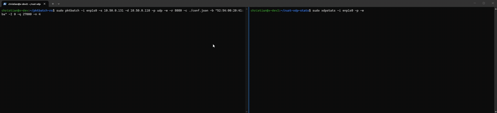

A tool that utilizes an awesome Rust library called [Aya](https://aya-rs.dev/book/) to deploy a simple XDP stats program. This tool increments counters for packets and bytes using a per CPU array map and displays the counters inside of the user-space program. There is a `matched` stat which is only incremented when packets arrive on UDP port [`TARGET_PORT`](https://github.com/gamemann/xdpstats/blob/main/xdpstats-common/src/config.rs#L4) (default: `8080`).



The goal of this project is to replicate functionality from my [XDP Stats](https://github.com/gamemann/XDP-Stats) project I made years ago in C using Rust and Aya along with adding additional features. The XDP/eBPF kernel program is written in Rust as well!

You can display the counters in rate per second or as a total count as seen in the demo above. With that said, there's also an included `watch` mode that displays stats in a TUI (by passing the `-w` flag). This is useful for monitoring stats in real time!

## 🚀 Features
* Support for calculating packet counters in both the **XDP eBPF program** and inside of **AF_XDP sockets**.
* Supports the option to have matched packets **dropped** or **TX'd** (with FIB lookup support!).
    * This is great if you want to test both drop and TX actions!
    * If FIB lookup isn't enabled, the ethernet, IP, and transport headers are swapped and the packet is sent back out the same interface it arrived on.
* Support for attaching to **multiple interfaces**.
* Display packet counters including total packets/bytes for different types of stats including *matched*, *error*, *bad*, *dropped*, and *passed* packets.
* Support for displaying stats in **rate per second** instead of total count.
* Support for a **watch mode** that displays stats in a TUI and updates in real time (as seen in the demo above).

## 🚨 Experimental
At this time, this project is still in **early development** and is not yet proven stable. I am still working on adding features and fixing bugs. The project is currently in a state where it is mostly functional, but there may be some issues that need to be resolved.

With that said, AF_XDP support is currently not tested! This is something I will be testing at some point soon!

## ⚙️ Preparing
I developed this project using Debian 13 and the following commands should prepare your environment to run this project. I'd recommend giving [this](https://aya-rs.dev/book/start/development.html) documentation a read as well!

```bash
# Install required packages through apt.
sudo apt install -y git curl cmake pkg-config libssl-dev llvm-19-dev libclang-19-dev libpolly-19-dev

# Install Rust using rustup.
curl --proto '=https' --tlsv1.2 -sSf https://sh.rustup.rs | sh

# We need the Rust stable and nightly toolchains.
rustup install stable
rustup toolchain install nightly --component rust-src

# Install linker.
cargo install bpf-linker

# This is optional, but will be needed if you want to generate your own Aya project:
# cargo install cargo-generate

# cargo generate https://github.com/aya-rs/aya-template
```

**NOTE** - The default README that comes with Aya projects may be found [here](./README_AYA.md). This README contains more information for other operating systems!

## 🛠️ Building & Running
Building and running this project is simple as long as you've ran the steps in the preparing section above.

You can use git to clone the project.

```bash
# Clone repository using Git
git clone https://github.com/gamemann/xdpstats

# Change to project directory.
cd xdpstats
```

You can then build and run the project using the following commands.

```bash
# Only build project.
cargo build

# Build project for release.
cargo build --release

# Build and run project in dev mode.
cargo run # Will fail if eth0 doesn't exist.

# Run project in release mode.,
cargo run --release

# Run project in release mode on interface 'enp1s0'.
cargo run --release -- -i enp1s0

# If you want to install to $PATH (/usr/bin), please use the included script!
sudo ./install_to_path.sh

# Now use it like a normal command!
sudo xdpstats -i enp1s0 -w -p
```

## 📝 Command Line Options
The following command line options are supported.

| Args | Default | Description |
| ---- | ------- | ----------- |
| `-i --iface` | `eth0` | The interface(s) to attach the XDP program to. You may separate interfaces with commas (e.g. `eth0,eth1`). |
| `-l --list` | - | If set, lists all setting values and exits. |
| `-L --log` | `info` | The log level to use. Supported values are `trace`, `debug`, `info`, `warn`, and `error`. |
| `-B --backlog` | `200` | The amount of log lines to keep in the buffer if using the watch mode. |
| `-w --watch` | - | If set, enables watch mode which displays log lines and stats in a TUI. |
| `-d --duration` | `0` | How long to run the program for in seconds (0 = unlimited util CTRL + C). |
| `-s --skb` | - | If set, attempts to load the XDP program in SKB mode which is slower, but more compatible. |
| `-o --offload` | - | If set, attempts to offload the XDP program to the NIC hardware (only certain NICs support this). |
| `-z --replace` | - | If set, passes the `REPLACE` flag when attaching the XDP program which replaces the XDP program if it is already loaded. For some reason this results in a crash. Otherwise it would be set by default. |
| `-p --per-sec` | `false` | If set, displays stats in rate per second instead of total count. |
| `-N --sec-name` | `xdp_stats` | The section name to use for the XDP program in the eBPF ELF file. This is only needed if you change the section name in the eBPF program. |

Here are settings for AF_XDP sockets.

| Args | Default | Description |
| ---- | ------- | ----------- |
| `-a --afxdp` | - | If set, redirects packets to AF_XDP sockets and calculates counters there instead. |
| `-n --num-socks` | `0` | The amount of AF_XDP sockets to create if using AF_XDP mode (0 = Auto). |
| `-b --batch-size` | `64` | The batch size to use when polling AF_XDP sockets. |
| `-r --rx-sz` | `2048` | The RX ring size to use for AF_XDP sockets. |
| `-t --tx-sz` | `2048` | The TX ring size to use for AF_XDP sockets. |
| `-c --cq-sz` | `2048` | The completion queue size to use for AF_XDP sockets. |
| `-F --fq-sz` | `2048` | The fill queue size to use for AF_XDP sockets. |
| `-f --frame-sz` | `2048` | The maximum amount of bytes a frame can hold for AF_XDP sockets. |
| `-m --frame-cnt` | `4096` | The amount of frames to use for AF_XDP sockets. |
| `-u --wakeup` | `false` | If set, enables wakeup mode for AF_XDP sockets which uses interrupts instead of busy polling. |
| `-x --zero-copy` | `false` | If set, enables zero copy mode for AF_XDP sockets which allows packets to be sent and received without copying data between user-space and kernel-space. |
| `-S --shared-umem` | `false` | If set, allows multiple AF_XDP sockets to share the same UMEM which can reduce memory usage. |
| `-q --queue-id` | `None` | The queue ID to use for AF_XDP sockets (0 = Auto; set to core ID from `0`). |
| `-p --poll-timeout` | `100` | The amount of time in milliseconds to wait when polling AF_XDP sockets. |

## 📝 Compile Time Configuration
There are constants you may change in the [`xdpstats-common/src/config.rs`](https://github.com/gamemann/xdpstats-rs/blob/main/xdpstats-common/src/config.rs) file. You will need to rebuild the tool after changing these values!

```rust
/* CONFIG OPTIONS */
/* -------------------------------- */
// The target UDP Port to match packets on.
pub const TARGET_PORT: u16 = 8080;

// The path to the ELF file to load with eBPF.
// Relative to $OUT_DIR env var, but you shouldn't need to change this.
pub const PATH_ELF_FILE: &str = "xdpstats";
/* -------------------------------- */
/* CONFIG OPTIONS END */
```

## ✍️ Credits
* [Christian Deacon](https://github.com/gamemann)